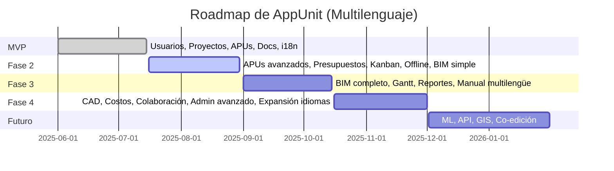

# Roadmap de Desarrollo para AppUnit (Multilenguaje)

## Consideraciones Multilenguaje (i18n/l10n)

- Todos los módulos y funcionalidades soportan traducción desde el MVP (mínimo español e inglés)
- Frontend: `react-i18next`, archivos de recursos por idioma
- Backend: Soporte `Accept-Language` y generación de mensajes traducibles
- Base de datos: JSON/campos auxiliares para descripciones multilingües

---

## Fase 1: MVP

- Gestión de usuarios, proyectos, recursos y documentos
- APUs manuales y presupuesto básico
- Soporte multilenguaje UI y mensajes clave
- Documentación inicial multilingüe

## Fase 2: Profundización

- APUs y presupuestos avanzados
- Gestión de tareas básica (Kanban)
- Offline mínimo
- Integración BIM visualización
- Traducción de validaciones y mensajes backend
- Documentación ampliada multilengüe

## Fase 3: Integraciones avanzadas

- Integración BIM completa (mapeo, extracción cantidades)
- Tareas avanzadas (Gantt, dependencias, recursos)
- Offline robusto (conflictos, sync background)
- Reportes y dashboards multilengües
- Gestión de roles y permisos
- Manual de usuario multilingüe

## Fase 4: Módulos especializados

- Integración CAD
- Control de costos
- Reportes avanzados y dashboards customizables
- Colaboración (comentarios, notificaciones)
- Admin avanzado
- Expansión de idiomas

## Fase X: Futuro

- ML, API, co-edición, GIS, más idiomas

---

## Tabla de Roadmap y Soporte Multilenguaje

| Fase   | Módulo/Funcionalidad         | Multilenguaje | Descripción breve                       |
|--------|------------------------------|---------------|-----------------------------------------|
| MVP    | Usuarios, Proyectos, Recursos| ✔️            | CRUD, UI traducida                      |
| MVP    | APUs manual, Presupuestos    | ✔️            | CRUD y cálculo, textos, reportes        |
| MVP    | Documentos                   | ✔️            | Subida y visualización básica           |
| MVP    | Configuración                | ✔️            | Moneda, selector de idioma              |
| F2     | APUs/presupuestos avanzados  | ✔️            | Importación, versionado, indirectos     |
| F2     | Kanban/Offline/BIM simple    | ✔️            | Tareas, offline, IFC viewer             |
| F3     | BIM, Tareas, Offline, Reportes| ✔️           | Mapping, Gantt, dashboards              |
| F4     | CAD, Costos, Colaboración    | ✔️            | DXF, control costos, comentarios        |
| FX     | ML, API, GIS                 | ✔️            | Innovación, integración avanzada        |

---

## Gantt (Mermaid)

